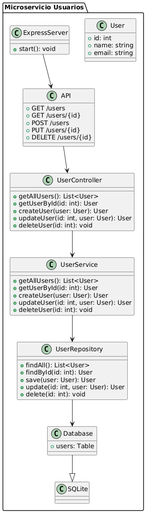

# Proyecto2-DYAS-P1 API: Microservicio de Gestión de Usuarios

## Universidad de la Sabana - Diseño y Arquitectura de Software

### Implementación de un Microservicio con Express y SQLite

## Descripción del Proyecto

Este proyecto implementa un **microservicio independiente** utilizando **Node.js con Express** y **SQLite** como base de datos ligera. El sistema permite gestionar usuarios a través de operaciones CRUD, siguiendo una arquitectura modular para facilitar su despliegue y escalabilidad.

## Requisitos del Proyecto

El sistema debe:

- Utilizar **Express** como framework para manejar las rutas y las peticiones HTTP.
- Utilizar **SQLite** como base de datos embebida y ligera para almacenar los usuarios.
- Implementar operaciones CRUD para gestionar la entidad `Usuario`.
- Seguir una arquitectura modular con separación de responsabilidades en controladores, servicios y modelos.

## Implementación

### Arquitectura del Microservicio

El microservicio sigue una estructura modular, asegurando la separación de responsabilidades:

#### Estructura del Proyecto:

```
users-service/            # Microservicio de gestión de usuarios
│── node_modules/         # Dependencias del proyecto
│── users.db              # Base de datos SQLite
│── package.json          # Configuración del proyecto y dependencias
│── index.js              # Punto de entrada del microservicio
│── db.js                 # Configuración de la base de datos
│── setup.js              # Creación de la tabla en la DB
│── models/               # Modelos de datos
│   ├── User.js           # Modelo de usuario con Objection.js
│── routes/               # Rutas del microservicio
│   ├── userRoutes.js     # Rutas CRUD de usuarios
│── .gitignore            # Ignorar archivos innecesarios como node_modules y la base de datos
```

### Operaciones CRUD Implementadas

El sistema permite realizar las siguientes operaciones sobre la entidad `Usuario`:

1. **Obtener todos los usuarios** (`GET /users`)
2. **Obtener un usuario por ID** (`GET /users/:id`)
3. **Crear un nuevo usuario** (`POST /users`)
4. **Actualizar un usuario existente** (`PUT /users/:id`)
5. **Eliminar un usuario** (`DELETE /users/:id`)

## Diagrama UML

A continuación se muestra el diagrama UML del sistema:



## Ejemplo de Uso en Postman

Para probar los endpoints del microservicio, puedes importar la siguiente colección en **Postman**:

1. **Obtener todos los usuarios:**
   - Método: `GET`
   - URL: `http://localhost:3000/users`
   - Respuesta esperada:
     ```json
     [
       { "id": 1, "name": "Juan Pérez", "email": "juan@example.com" }
     ]
     ```

2. **Crear un usuario:**
   - Método: `POST`
   - URL: `http://localhost:3000/users`
   - Cuerpo:
     ```json
     {
       "name": "Juan Pérez",
       "email": "juan@example.com",
       "birthdate": "1990-05-15",
       "gender": "Masculino",
       "document_id": "1234567890"
     }
     ```
   - Respuesta esperada:
     ```json
     {
       "id": 1,
       "name": "Juan Pérez",
       "email": "juan@example.com",
       "birthdate": "1990-05-15",
       "gender": "Masculino",
       "document_id": "1234567890"
     }
     ```

3. **Actualizar un usuario:**
   - Método: `PUT`
   - URL: `http://localhost:3000/users/1`
   - Cuerpo:
     ```json
     {
       "name": "Juan Pérez Actualizado",
       "email": "juan_actualizado@example.com",
       "birthdate": "1990-05-15",
       "gender": "Masculino",
       "document_id": "1234567890"
     }
     ```
   - Respuesta esperada:
     ```json
     {
       "id": 1,
       "name": "Juan Pérez Actualizado",
       "email": "juan_actualizado@example.com",
       "birthdate": "1990-05-15",
       "gender": "Masculino",
       "document_id": "1234567890"
     }
     ```

4. **Eliminar un usuario:**
   - Método: `DELETE`
   - URL: `http://localhost:3000/users/1`
   - Respuesta esperada:
     ```json
     { "message": "Usuario eliminado" }
     ```

## Ejecución del Proyecto

1. Clonar el repositorio:
   ```sh
   git clone https://github.com/usuario/Proyecto2-DYAS-P1.git
   cd Proyecto2-DYAS-P1
   ```

2. Instalar dependencias:
   ```sh
   npm install
   ```

3. Crear la base de datos y configurar la tabla `users`:
   ```sh
   node setup.js
   ```

4. Iniciar el servidor:
   ```sh
   node index.js
   ```

5. Acceder a los endpoints en `http://localhost:3000/users`

## Autor

**Andrés Azcona**  
Estudiante de Ingeniería Informática  
**Universidad de La Sabana**

